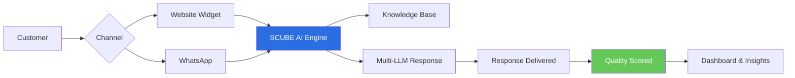
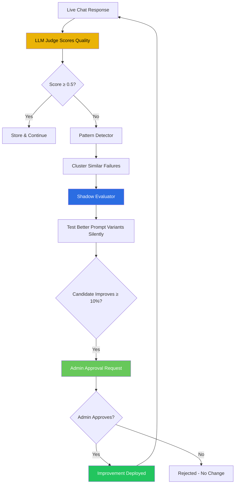
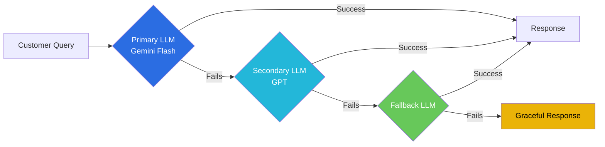
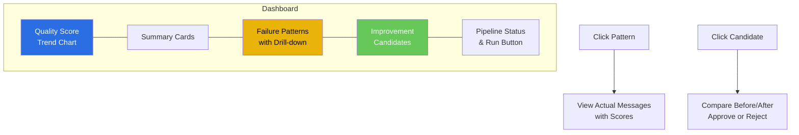

# SCUBE AI — Intelligent Chatbot Platform

  

*A Product of **SCUBE Infotech Pte Ltd** — [scubeinfotech.com.sg](https://scubeinfotech.com.sg)*

---

## Executive Summary

SCUBE AI is a unified intelligent chatbot platform that serves your customers across **website widget** and **WhatsApp** — all powered by a single AI engine that **learns and improves automatically**. Unlike static chatbot builders, SCUBE AI scores every response, detects failure patterns, silently tests better alternatives, and deploys improvements — all with admin approval. Your chatbot gets smarter every day without you lifting a finger.

---

## 1. The Communication Challenge

| Problem | Impact |
|---|---|
| Scattered customer conversations across web and WhatsApp | No unified view, inconsistent responses |
| Chatbots give the same wrong answers repeatedly | Customer frustration, brand damage |
| No visibility into quality or recurring failures | Blind to problems, reactive fixes only |
| High support costs with no improvement loop | Static costs, no path to efficiency |

---

## 2. One Platform, Every Channel

SCUBE AI unifies your customer conversations under one intelligent engine.

**Key benefits:**
- Single AI engine — consistent answers across all channels
- Customer context follows them between web and WhatsApp
- One dashboard to monitor all conversations

---

## 3. The Self-Learning Engine ⭐

**This is our core differentiator.** No other platform does this out of the box.

**What this means for your business:**

| Capability | Benefit |
|---|---|
| **Auto-scoring** | Every response evaluated across 5 dimensions (relevance, accuracy, completeness, conciseness, tone) |
| **Pattern detection** | Systematic failures are automatically clustered and surfaced — you see the root cause, not just symptoms |
| **Silent testing** | The system tries better prompt variants in the background, zero impact on live customers |
| **Admin approval gate** | Nothing changes without your approval — full control, full visibility |
| **Continuous improvement** | The platform gets measurably better every day, automatically |

---

## 4. Always On, Always Accurate

**Reliability features:**
- **Multi-LLM fallback chain** — if one AI provider fails, another takes over instantly
- **Auto-crawl knowledge base** — SCUBE AI can automatically crawl your website to keep its knowledge up to date
- **Zero downtime** — Docker-based deployment, no single point of failure
- **Docker containerized** — deploy on your infrastructure or ours

---

## 5. Know What's Working

The admin dashboard gives you full visibility into your chatbot's performance:

**What you can see at a glance:**
- **Average quality score** — overall health of your chatbot
- **Failure patterns** — recurring issues clustered by topic, with drill-down to actual messages
- **Improvement candidates** — before/after comparisons ready for your approval
- **Quality trends** — 14-day charts showing improvement over time
- **Pipeline status** — see when the self-learning engine last ran

---

## 6. Competitive Comparison

| Feature | **SCUBE AI** | Dialogflow CX | Botpress | Rasa | Zendesk AI |
|---|---|---|---|---|---|
| **Web Widget** | ✅ Built-in | ✅ | ✅ | ❌ | ✅ |
| **WhatsApp** | ✅ Native | ✅ | ✅ | ✅ | ✅ |
| **Self-Learning Engine** | ✅ **Built-in** | ❌ | ❌ | ❌ | ❌ |
| **LLM-as-Judge Scoring** | ✅ **5 dimensions** | ❌ | ❌ | ❌ | ❌ |
| **Failure Pattern Detection** | ✅ **Automatic** | ❌ | ❌ | ❌ | ❌ |
| **Admin Approval Gate** | ✅ **Full control** | ❌ | ❌ | ❌ | ❌ |
| **Multi-LLM Fallback** | ✅ **Automatic** | ❌ | ❌ | Custom | ❌ |
| **Auto-Crawl Knowledge Base** | ✅ **Built-in** | ❌ | ❌ | ❌ | ❌ |
| **Docker Deployment** | ✅ **Your infra** | ❌ Cloud only | ✅ | ✅ | ❌ Cloud only |
| **Unified Dashboard** | ✅ **All-in-one** | ✅ | ✅ | ❌ | ✅ |

---

## 7. Deployment & Security

| Aspect | SCUBE AI Approach |
|---|---|
| **Deployment** | Docker containers — deploy on your cloud or ours |
| **Data residency** | Your data stays on your infrastructure |
| **Data sharing** | Zero — no third-party training on your conversations |
| **Scaling** | Horizontal — add containers as volume grows |
| **Upgrades** | Rolling updates, zero downtime |

---

## 8. ROI Summary

| Metric | Impact |
|---|---|
| **Customer satisfaction** | Consistent, high-quality responses across all channels |
| **Support costs** | Reduce with auto-improvement loop — fewer escalations |
| **Agent time** | Chatbot handles routine queries, humans handle exceptions |
| **Improvement velocity** | Daily auto-improvement vs monthly manual updates |
| **Risk** | Admin approval gate prevents bad changes from reaching customers |

---

## About SCUBE Infotech

SCUBE AI is built by **SCUBE Infotech**, a Singapore-based technology company specializing in intelligent automation and AI solutions.

**SCUBE Infotech**  
Sim Lim Tower, 10 Jalan Besar, #09-10A  
Singapore 208787  

**+65 8078 6788** · **admin@scubeinfotech.com.sg**  
[scubeinfotech.com.sg](https://scubeinfotech.com.sg)

---

*SCUBE AI — Intelligent Solutions. Smarter Every Day.*
